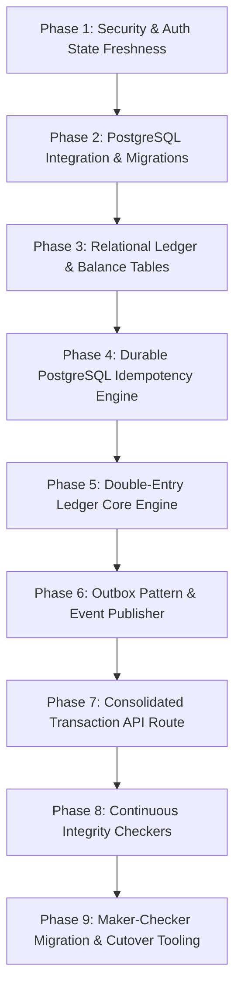

# AFRA-PAY-FINAL-IMPLEMENTATION-READINESS-V2.md

## 1. Executive Decision

**STATUS:** `NOT READY FOR IMPLEMENTATION — ARCHITECTURE CORRECTIONS REQUIRED`

### Unresolved Architecture Blockers:
1. **Active Direct Mutable Balance Writes:** The codebase contains direct, sequential, un-transactional balance updates directly on Appwrite documents in multiple active files.
   * *Evidence:* 
     * [backend/src/services/walletService.js:115](backend/src/services/walletService.js#L115) (`debitMerchantWallet`) and [line 168](backend/src/services/walletService.js#L168) (`creditMerchantWallet`) perform isolated `updateDocument` calls on floating-point balances.
     * [backend/src/services/walletTransferService.js:150-153](backend/src/services/walletTransferService.js#L150-L153) and [lines 175-178](backend/src/services/walletTransferService.js#L175-L178) execute separate, non-atomic updates to sender and receiver wallets.
     * [backend/src/controllers/secureTransactionController.js:323-328](backend/src/controllers/secureTransactionController.js#L323-L328) and [lines 345-350](backend/src/controllers/secureTransactionController.js#L345-L350) execute manual application-calculated updates.
2. **Complete Absence of Relational Database Infrastructure:** PostgreSQL drivers and database pooling connections are entirely missing from the codebase.
   * *Evidence:* [backend/package.json](backend/package.json) contains no references to `pg`, `pg-pool`, or any relational database driver/ORM. No SQL migration scripts or pool configurations exist.
3. **Broken Redis Connection & Idempotency Integration:** The middleware attempts to invoke an undefined module export, causing a silent fallback to volatile in-memory storage.
   * *Evidence:* [backend/src/middleware/security/idempotency.js:65](backend/src/middleware/security/idempotency.js#L65) attempts to import `createClient` from `../../database/connection.js`, which does not exist as an export (the file exports `getClient` and `databaseManager` instead), resulting in a silent fallback to `memStore` (a local Javascript `Map()`).
4. **Stateless Stale JWT Token Claims Trusted:** The authentication middleware accepts tokens at face value without validating live account status or role changes.
   * *Evidence:* [backend/src/middleware/auth/authenticate.js:152-160](backend/src/middleware/auth/authenticate.js#L152-L160) explicitly comments out user database reload and status check, accepting expired, deactivated, or modified user claims as valid.
5. **Duplicate Peer-to-Peer Transfer Code Paths:** Overlapping implementations exist for transferring funds, increasing the risk of inconsistent business rule enforcement.
   * *Evidence:* [backend/src/controllers/secureTransactionController.js:189](backend/src/controllers/secureTransactionController.js#L189) (`processTransfer`) and [backend/src/services/walletTransferService.js:75](backend/src/services/walletTransferService.js#L75) (`execute`) implement duplicate, separate transfer pathways.

---

## 2. Final Architecture Decisions

| Component | Final Choice | Technical Justification | System Role |
| :--- | :--- | :--- | :--- |
| **Financial Ledger Engine** | PostgreSQL Relational Ledger | Appwrite lacks row-level locking, ACID transactions, and sequential serialization capability. | Immutable source-of-truth. |
| **Precision Model** | BigInt Minor Units | Floating-point variables (`double`/`float`) introduce rounding errors ($\text{SSP} \times 10^2$ cents). | Eliminates math anomalies. |
| **Accounting Standard** | Double-Entry Bookkeeping | Strictly maintains the system invariant: $\sum \text{Debits} - \sum \text{Credits} = 0$. | Architectural mathematical control. |
| **Balance Management** | Derived Read Projections | Derived tables updated atomically inside the ledger transaction. | High-performance read path. |
| **Idempotency Engine** | PostgreSQL Unique Constraints | Ensures durable, crash-resistant exact-once semantics. | Prevents double-spending. |
| **Concurrency Control** | Sorted Deterministic Pessimistic Locking | Locks rows via `SELECT ... FOR UPDATE` ordered by ID to eliminate deadlocks. | High-throughput collision control. |
| **Auth Freshness** | Real-time Database Status Checks | Halts hijacked, suspended, or modified sessions immediately. | Active gatekeeping. |
| **Transaction Signing** | Server-side Argon2id Hash Verification | Cryptographically verifies high-value transactions with adaptive parameters. | Secures endpoint execution. |
| **Appwrite Role** | Non-financial Application Storage | Perfect for rapid document storage and static assets. | Non-critical metadata. |
| **Redis Role** | Distributed Cache & Idempotency Fast-Path | Speeds up initial validation before PostgreSQL locks. | Volatile caching layer. |
| **Audit Protocol** | Transactional Outbox Pattern | Commits outbox events and ledger updates in a single SQL transaction. | Atomic audit integrity. |

---

## 3. Final Idempotency Semantics

### Composite Unique Index Scope
To prevent namespace collisions, multi-operation key reuse, or cross-tenant replay attacks, the idempotency layer must be backed by a PostgreSQL table `idempotency_records` with a strict composite primary key:
```sql
PRIMARY KEY (actor_id, operation, idempotency_key)
```
*   `actor_id`: `VARCHAR(36)` (The authenticated user or merchant ID executing the request).
*   `operation`: `VARCHAR(64)` (The specific API endpoint, e.g., `transactions.send`, `payout.execute`).
*   `idempotency_key`: `VARCHAR(36)` (The client-supplied UUID v4).

### Table Schema: `idempotency_records`
```sql
CREATE TABLE idempotency_records (
    actor_id VARCHAR(36) NOT NULL,
    operation VARCHAR(64) NOT NULL,
    idempotency_key VARCHAR(36) NOT NULL,
    request_hash VARCHAR(64) NOT NULL, -- SHA-256 hash of the sanitized request body
    status VARCHAR(20) NOT NULL CHECK (status IN ('processing', 'completed', 'failed')),
    response_code INTEGER,
    response_payload JSONB,
    ledger_transaction_id VARCHAR(36) REFERENCES ledger_transactions(ledger_transaction_id),
    created_at TIMESTAMPTZ DEFAULT CURRENT_TIMESTAMP,
    updated_at TIMESTAMPTZ DEFAULT CURRENT_TIMESTAMP,
    PRIMARY KEY (actor_id, operation, idempotency_key)
);
CREATE INDEX idx_idempotency_expiry ON idempotency_records(created_at);
```

### Request Replay and Conflict Handling Flowchart
```
                Incoming POST Request (Key, Body)
                                │
               Generate SHA-256 of Request Body
                                │
          Check PostgreSQL: SELECT * WHERE Composite Key
                                │
         ┌──────────────────────┴──────────────────────┐
      Found?                                       Not Found?
         │                                             │
   ┌─────┴───────────────────┐                         │
Status = 'processing'?    Status = 'completed'?        │
   │                         │                         │
  Yes (Concurrent Call)     Yes                        │
   │                         │                         │
┌──┴─────────────┐    ┌──────┴───────────────┐         │
│  Return 409    │    │ Does Hash Match?     │         │
│  Conflict      │    └──┬───────────────┬───┘         │
└────────────────┘      Yes              No            │
                         │               │             │
                ┌────────┴───────┐ ┌─────┴──────────┐  │
                │ Replay Cached  │ │ Return 409     │  │
                │ JSON Response  │ │ Body Conflict  │  │
                └────────────────┘ └────────────────┘  │
                                                       │
  ┌────────────────────────────────────────────────────┘
  │
  ▼
INSERT INTO idempotency_records (status = 'processing')
  │
  ├─► Catch UNIQUE_VIOLATION? ──► Return 409 Conflict (Lost concurrent race)
  │
Execute Financial Business Logic within SQL Transaction Block
  │
  ├─► Success: UPDATE status = 'completed', response_payload, response_code
  │
  └─► 5xx System Error or Crash: DO NOT DELETE record. Mark status = 'failed'
```

### Architectural Rules
1. **No Automatic Deletions on 5xx Errors:** If a transaction handler crashes, times out, or returns a 5xx, the idempotency record **must never** be deleted. Deleting the record creates a vulnerability where a client can retry a transaction that actually executed on the ledger or downstream bank but failed to return a response. Instead, the record is updated to `status = 'failed'`, capturing the failure. This prevents retry execution of the business path until reconciled.
2. **Request Hash Invariance:** If the composite key matches but the current request payload's SHA-256 hash differs from `request_hash`, the server must reject with `HTTP 409 Conflict` (indicating a reused key for a different logical request).
3. **Redis Optimization vs. PostgreSQL Guarantee:** Redis may be checked first (`EXISTS idm:actor_id:operation:key`) as a high-speed optimization. However, the final transactional lock and execution safety must rely entirely on the PostgreSQL unique composite index insert.

---

## 4. Final Concurrency Model

### Double-Entry Ledger and Account Balance Invariant
The system utilizes an immutable, append-only transaction ledger.
*   **Balance Derivation:** The authoritative balance of any account $A$ is the sum of its ledger entry historical records:
    $$\text{Balance}(A) = \sum \text{Credits}(A) - \sum \text{Debits}(A)$$
*   **Atomic Balances Table:** To allow fast read operations, a cached table `account_balances` is updated **within the same SQL transaction** as the ledger entries. This table acts as a read projection.
```sql
CREATE TABLE account_balances (
    account_id VARCHAR(36) PRIMARY KEY REFERENCES ledger_accounts(account_id),
    balance_minor BIGINT NOT NULL DEFAULT 0,
    version BIGINT NOT NULL DEFAULT 1,
    updated_at TIMESTAMPTZ DEFAULT CURRENT_TIMESTAMP
);
```

### Pessimistic Concurrency and Locking Strategy
Under high concurrent loads (e.g., automated P2P transfer requests or merchant point-of-sale spikes), the system blocks race conditions and negative balances using row-level locking.
1. **Deterministic Sorted Row Locking:** To avoid deadlocks, the database locks accounts in a strict, ascending alphabetical order of their `account_id`s.
2. **Transaction Isolation Level:** Standard `READ COMMITTED` paired with deterministic `SELECT ... FOR UPDATE` is chosen over `SERIALIZABLE`.
   * *Justification:* `SERIALIZABLE` isolation is highly prone to serialization anomalies (`40001` serialization failures) under hot-spot account write conditions (such as system fee wallets). Handling these requires complex, high-latency application retry loops that degrade throughput. `READ COMMITTED` paired with sorted `SELECT ... FOR UPDATE` guarantees that concurrent transactions competing for the exact same rows are forced into an orderly, sequential queue, ensuring absolute balance consistency with zero serialization rollbacks.

### Core Ledger Transaction Execution Flow
```javascript
// Canonical implementation pattern for Ledger Posting
async function executeLedgerTransfer(dbClient, {
  idempotencyKey,
  reference,
  currency,
  amountMinor,
  senderAccountId,
  recipientAccountId,
  description,
  initiatedBy
}) {
  return dbClient.tx(async t => {
    // 1. Assert idempotency insert first
    const requestHash = crypto.createHash('sha256').update(JSON.stringify({amountMinor, currency})).digest('hex');
    try {
      await t.none(
        `INSERT INTO idempotency_records (actor_id, operation, idempotency_key, request_hash, status) 
         VALUES ($1, 'transfer', $2, $3, 'processing')`,
        [initiatedBy, idempotencyKey, requestHash]
      );
    } catch (err) {
      if (err.code === '23505') { // PostgreSQL Unique Violation
        throw new ConflictError("Idempotent conflict: Transaction already executing or completed.");
      }
      throw err;
    }

    // 2. Sort account IDs to prevent deadlocks
    const sortedAccounts = [senderAccountId, recipientAccountId].sort();

    // 3. Acquire pessimistic locks sequentially
    const lockedBalances = {};
    for (const accountId of sortedAccounts) {
      const balanceRow = await t.one(
        `SELECT b.balance_minor, a.status, a.owner_id 
         FROM account_balances b 
         JOIN ledger_accounts a ON a.account_id = b.account_id 
         WHERE b.account_id = $1 FOR UPDATE`,
        [accountId]
      );
      
      if (balanceRow.status !== 'active') {
        throw new ValidationError(`Account ${accountId} is currently ${balanceRow.status}`);
      }
      lockedBalances[accountId] = BigInt(balanceRow.balance_minor);
    }

    // 4. Assert financial invariant (e.g., sender has sufficient funds)
    const senderBalance = lockedBalances[senderAccountId];
    const amountBig = BigInt(amountMinor);
    if (senderBalance < amountBig) {
      throw new InsufficientFundsError();
    }

    // 5. Generate Ledger Transaction record
    const ledgerTxId = crypto.randomUUID();
    await t.none(
      `INSERT INTO ledger_transactions (ledger_transaction_id, idempotency_key, reference, currency, amount_minor, status, description, initiated_by)
       VALUES ($1, $2, $3, $4, $5, 'posted', $6, $7)`,
      [ledgerTxId, idempotencyKey, reference, currency, amountMinor, description, initiatedBy]
    );

    // 6. Write Immutable Ledger Entry (Debit Sender)
    await t.none(
      `INSERT INTO ledger_entries (entry_id, ledger_transaction_id, account_id, direction, amount_minor)
       VALUES (gen_random_uuid(), $1, $2, 'debit', $3)`,
      [ledgerTxId, senderAccountId, amountMinor]
    );

    // 7. Write Immutable Ledger Entry (Credit Recipient)
    await t.none(
      `INSERT INTO ledger_entries (entry_id, ledger_transaction_id, account_id, direction, amount_minor)
       VALUES (gen_random_uuid(), $1, $2, 'credit', $3)`,
      [ledgerTxId, recipientAccountId, amountMinor]
    );

    // 8. Update Derived Read Projection Balances
    await t.none(
      `UPDATE account_balances SET balance_minor = balance_minor - $1, version = version + 1, updated_at = NOW() WHERE account_id = $2`,
      [amountMinor, senderAccountId]
    );
    await t.none(
      `UPDATE account_balances SET balance_minor = balance_minor + $1, version = version + 1, updated_at = NOW() WHERE account_id = $2`,
      [amountMinor, recipientAccountId]
    );

    // 9. Update Idempotency Record to Completed
    const responsePayload = { success: true, transactionId: ledgerTxId, reference };
    await t.none(
      `UPDATE idempotency_records 
       SET status = 'completed', response_code = 201, response_payload = $1, ledger_transaction_id = $2
       WHERE actor_id = $3 AND operation = 'transfer' AND idempotency_key = $4`,
      [responsePayload, ledgerTxId, initiatedBy, idempotencyKey]
    );

    return responsePayload;
  });
}
```

---

## 5. Final Accounting Model

### Chart of Accounts (COA) Structure and Invariants

| Account Code Path | Account Type | Normal Balance | Owner Scope | Functional Purpose |
| :--- | :--- | :--- | :--- | :--- |
| `acc_usr_<uuid>` | Liability | Credit | End User | Represents the withdrawable stored value of an individual user. |
| `acc_mer_<uuid>` | Liability | Credit | Merchant | Holds accumulated merchant proceeds from sales transactions. |
| `acc_sys_clearing` | Asset | Debit | System (Platform) | Holds incoming external payment funds awaiting bank settlement. |
| `acc_sys_fees` | Income | Credit | System (Platform) | Earned transaction processing revenue and service charges. |
| `acc_sys_suspense` | Asset/Liability | Debit (Neutral) | System (Platform) | Temporary bucket for un-reconciled, mismatched transaction entries. |
| `acc_sys_opening` | Equity | Credit | System (Platform) | Anchor node used purely during migration to inject historical balances. |

### Operational Accounting Invariants
*   **Balance Conservation:** $\sum \text{Assets} = \sum \text{Liabilities} + \sum \text{Equity} + (\sum \text{Income} - \sum \text{Expenses})$
*   **Postings Invariance:** Every ledger transaction must comprise a set of entries whose algebraic sum equals zero (Debits counted as negative, Credits as positive).

### Peer-to-Peer Transfer Ledger Journalization
For a transfer of 10,000 SSP (expressed in minor units as `1000000` cents) from User A to User B, with zero platform fees:
*   **Transaction:** Amount = `1000000 SSP`, Currency = `SSP`
```
Debit  acc_usr_user_a_uuid   1,000,000  (Decreases User A's Wallet Liability)
Credit acc_usr_user_b_uuid              1,000,000  (Increases User B's Wallet Liability)
```

### Peer-to-Peer Transfer with Platform Fee
For a transfer of 10,000 SSP with a platform fee of 1% (100 SSP / `10000` cents) charged to the sender:
```
Debit  acc_usr_user_a_uuid   1,010,000  (Debits transfer amount + fee from Sender)
Credit acc_usr_user_b_uuid              1,000,000  (Credits transfer amount to Recipient)
Credit acc_sys_fees                        10,000  (Credits fee revenue to the platform)
```

### Controlled Account Provisioning (No Implicit Creation)
Accounts must never be implicitly or lazily provisioned during financial transfers. This guarantees that un-vetted, un-KYCed entities cannot hold balances.
*   **Rule:** Every user and merchant must go through an explicit registration and onboarding flow. Upon successful KYC Level 1 clearance, a service must issue a synchronous, audited call to provision their corresponding `ledger_accounts` and `account_balances` rows. Any transaction attempting to debit or credit a non-existent account ID must immediately abort with an explicit `HTTP 422 Unprocessable Entity` error.

---

## 6. Final Security & Authentication Model

### Authoritative Authentication and Session Validation
JWT token validation is stateful for sensitive actions. While cryptographic signatures verify token integrity, session validity must be checked live on every mutating financial API request.
1. **Freshness Validation Middleware:** Every request hitting financial routes re-validates against PostgreSQL/Redis cache:
   * **Active Session Check:** Query `active_sessions` table/cache to ensure the session ID (`sessionId`) exists and is marked active.
   * **Account Status Verification:** Query the database to ensure the user's status is `active` (rejecting suspended or blocked users immediately).
   * **KYC Freshness Check:** Re-read `kyc_level` to prevent execution of transactions that exceed updated limits.
   * **Token Revocation Check:** Confirm the token's JWT ID (`jti`) is not listed in the Redis token blacklist.

### PIN Terminal Security Model
1. **Hashing Algorithm:** PIN codes must be hashed using **Argon2id** (the industry-standard memory-hard algorithm for credentials) rather than bcrypt or MD5.
   * *Argon2id Parameter Profile:* $m=19456$ KiB (19 MiB memory cost), $t=2$ iterations, $p=1$ parallelism.
2. **Failed PIN Attempt Controls & Lockout Rules:**
   * **Sliding-Window Rate Limiting:** A Redis tracker tracks failed attempts: `rate:pin:actor_id`. Maximum of 5 failed attempts per 15 minutes.
   * **Account Lockout:** Upon the 5th consecutive failure, the user's transaction execution capability is disabled (`accountStatus` in the user's DB record is updated to `frozen` or a dedicated flag `tx_locked` is set to `true`).
   * **Unlock Protocol:** Recovery from a PIN lockout requires out-of-band multi-factor verification (MFA challenge verification) or administrator-assisted identity re-verification.
3. **Audit and Non-repudiation:** Every PIN verification event must be recorded in the security logs with IP address, device fingerprint, and status (success/failure). **The raw PIN code must never be logged or printed under any circumstances.**

---

## 7. Audit, Outbox & Reconciliation

### Transactional Outbox Pattern
To prevent distributed transaction failures (e.g., balance is debited but a notification fails to send, or the server crashes before logging), the system strictly implements the **Transactional Outbox Pattern**.
```
   PostgreSQL DB Transaction Block
┌──────────────────────────────────────────────┐
│                                              │
│ 1. Verify Idempotency & Lock Balances        │
│                                              │
│ 2. Insert Ledger Entries (Debit & Credit)    │
│                                              │
│ 3. Update Cached Account Balances            │
│                                              │
│ 4. Insert Outbox Event Table                 │
│    "event_type": "transaction.completed"     │
│                                              │
│ 5. Commit Transaction                        │
│                                              │
└──────────────────────┬───────────────────────┘
                       │ Atomically Persisted
                       ▼
             Poller / Dequeue Worker
                       │
       ┌───────────────┴───────────────┐
       ▼                               ▼
Dispatch Email                  Trigger Webhook
Push Notification               To Merchant Server
```
*   **Guarantee:** The outbox event is physically written and committed inside the exact same relational transaction as the financial ledger updates. This ensures that an event is *never* generated unless the money has successfully moved, and *always* generated if the money does move.

### Automated Internal Integrity Checks (Invariants)
The system runs an automated cron worker executing a continuous loop verifying ledger integrity:
1. **Mathematical Conservation Check:** Runs every 10 minutes.
   ```sql
   SELECT SUM(amount_minor * CASE WHEN direction = 'credit' THEN 1 ELSE -1 END) AS imbalance
   FROM ledger_entries;
   -- ASSERTION: imbalance MUST equal 0.00 exactly.
   ```
2. **Read-Projection Reconciliation:** Checks that cached read projections match the actual entry history:
   ```sql
   SELECT a.account_id, b.balance_minor, SUM(e.amount_minor * CASE WHEN e.direction = 'credit' THEN 1 ELSE -1 END) AS entry_sum
   FROM ledger_accounts a
   JOIN account_balances b ON b.account_id = a.account_id
   JOIN ledger_entries e ON e.account_id = a.account_id
   GROUP BY a.account_id, b.balance_minor
   HAVING b.balance_minor <> SUM(e.amount_minor * CASE WHEN e.direction = 'credit' THEN 1 ELSE -1 END);
   -- ASSERTION: This query MUST return 0 rows.
   ```
3. **Breach Action:** If any mismatch is detected, the worker triggers an immediate high-priority pager alert (PagerDuty/Slack webhook) and places a global hold on affected transaction routes to protect funds.

### External Reconciliation Loop
Every 24 hours, the system executes an automated sweep:
1. **Reconciliation Target:** Downstream financial providers (M-Pesa, Flutterwave, Stripe) submit ledger transaction dumps.
2. **Verification Logic:** The reconciliation script matches provider reference IDs against `ledger_transactions` posted under `acc_sys_clearing`.
3. **Suspense Routing:** Any mismatch (e.g., bank settled \$100, but ledger recorded \$98) must be posted to `acc_sys_suspense` with an automatic system warning. Suspense accounts are *never* a normal operational path and are strictly reserved for these audited exceptions.

---

## 8. Migration & Recovery Rules

```
                 MIGRATION PHASE (Pre-Cutover)
┌─────────────────────────────────────────────────────────────┐
│ 1. Freeze Appwrite Balances (Enable Maintenance Mode)       │
│                                                             │
│ 2. Take Immutable Snapshot of Appwrite Wallets & Checksums  │
│                                                             │
│ 3. Seed PostgreSQL 'ledger_accounts' for all valid Users     │
│                                                             │
│ 4. Post Opening Balance Journal Entries:                    │
│    Debit 'acc_sys_opening' / Credit 'acc_usr_<id>'          │
│                                                             │
│ 5. Verify Invariant:                                        │
│    Sum(Appwrite Snapshot) == Credit(PostgreSQL Accounts)   │
│                                                             │
│ 6. Obtain Cryptographic Hash & Two-Person Approval Signature│
└──────────────────────────────┬──────────────────────────────┘
                               │
                ┌──────────────┴──────────────┐
         Check Passed?                 Check Failed?
                │                             │
                ▼                             ▼
       [ CUTOVER PATH ]               [ ROLLBACK PATH ]
┌──────────────────────────────┐    ┌─────────────────────────┐
│ 1. Sever Appwrite Write Path │    │ 1. Abort PostgreSQL DB  │
│                              │    │                         │
│ 2. Direct API to Postgres    │    │ 2. Disable Maintenance  │
│                              │    │    Mode on Appwrite     │
│ 3. Live Production Execution │    │                         │
│                              │    │ 3. Resume Legacy Path   │
└──────────────────────────────┘    └─────────────────────────┘
```

### Post-Cutover Disaster Recovery Protocol
Once the cutover is executed and the Appwrite balance path is severed, **the write path to Appwrite balances is permanently closed. Reverting to Appwrite is strictly forbidden.**
1. **Handling Operational Failures:** If a critical database bug, corruption, or infrastructure failure occurs post-cutover:
   * **Step 1: Controlled Halt:** Immediately route API traffic to an immutable static Maintenance Mode page, pausing all state mutation.
   * **Step 2: Point-In-Time Recovery (PITR):** Restore the PostgreSQL cluster using WAL logs to a sub-second transaction window immediately preceding the corruption or event.
   * **Step 3: Automated Ledger Reconciliation:** Run the integrity checking scripts to verify post-restoration balance states.
   * **Step 4: Compensating Entries:** Correct errors by posting explicit, audited, reversing ledger entries. Ledger records are immutable; values must never be manually overwritten, deleted, or modified.

---

## 9. Testing & Readiness Matrix

| Readiness Gate ID | Target Scenario | Setup and Trigger | Expected Assertions & Metrics |
| :--- | :--- | :--- | :--- |
| **TG-01** | Concurrent Duplicate Requests | Spawn 50 threads executing P2P transfers using the exact same `Idempotency-Key` and payload simultaneously. | * Exactly 1 request succeeds with HTTP 201.<br>* 49 requests fail with HTTP 409 Conflict.<br>* Sender balance is debited exactly once. |
| **TG-02** | Timeout Followed by Retry | 1. Initiate transfer.<br>2. Simulate network timeout.<br>3. Retry exact same request. | * Initial execution commits successfully.<br>* Retry returns the cached transaction response without re-executing balance checks. |
| **TG-03** | Crash-After-Commit | 1. Execute transfer inside PostgreSQL.<br>2. Kill connection/crash process before sending response. | * Transaction remains safely committed.<br>* Idempotency record shows `status = 'processing'` or `completed` with cached response; retry reclaims it safely. |
| **TG-04** | PostgreSQL Failure | 1. Break DB connection during transfer.<br>2. Try to run ledger updates. | * Application rollback cleanly.<br>* Zero half-executed transfers or inconsistent balances.<br>* HTTP 503 Service Unavailable returned. |
| **TG-05** | Redis Failure | 1. Terminate Redis service.<br>2. Submit transaction. | * System degrades gracefully.<br>* Requests process securely by bypassing Redis cache and using PostgreSQL-backed idempotency. |
| **TG-06** | Deadlock Simulation | Execute concurrent reverse transfers: Thread A (User 1 $\to$ User 2) and Thread B (User 2 $\to$ User 1) simultaneously. | * Locks are acquired in strict deterministic sorting order.<br>* Both transactions execute successfully without deadlock errors. |
| **TG-07** | Frozen/Closed Wallets | 1. Freeze recipient wallet.<br>2. Attempt transfer. | * Pessimistic lock fails account status verification.<br>* DB transaction rollbacks completely; zero funds move. |
| **TG-08** | Insufficient Funds | 1. Set sender balance to 1,000 cents.<br>2. Attempt transfer of 1,001 cents. | * Invariant assertion fails.<br>* Aborts with Insufficient Funds error; sender balance remains unchanged. |
| **TG-09** | Reversal Execution | Execute partial credit failure flow. | * Original ledger entry is untouched.<br>* Separate, audited reversing entry is posted: Debit Recipient / Credit Sender. |
| **TG-10** | Provider Duplicate Event | Simulate payment gateway sending duplicate webhook events twice. | * Unique constraint on provider reference ID rejects second webhook.<br>* Returns HTTP 200/204 to provider without double-crediting. |
| **TG-11** | Backup Restore / PITR | 1. Corrupt derived balance.<br>2. Restore database from backup + WAL. | * Restoration returns database to fully consistent state.<br>* Ledger checksum verifies successfully. |
| **TG-12** | Ledger Reconciliation | Run invariant validation script against modified balances. | * Drift detection flags errors immediately.<br>* Automated ledger sum successfully rebuilds correct account balances. |

---

## 10. Exact Implementation Order



### Phase 1: Security & Auth State Freshness
*   Add Argon2id configuration and parameters in environment settings.
*   Refactor [backend/src/middleware/auth/authenticate.js](backend/src/middleware/auth/authenticate.js) to query live account status and token blacklist verification on every request.
*   Implement Argon2id PIN verification and sliding-window rate limiting in Redis.

### Phase 2: PostgreSQL Integration & Migrations
*   Install `pg` and `pg-pool` dependencies in [package.json](package.json).
*   Create `pgConnection.js` with structured pool configurations, SSL support, and health check routes.
*   Establish directory structure for raw SQL migrations.

### Phase 3: Relational Ledger & Balance Tables
*   Write and run schema migration to deploy the physical ledger tables:
    *   `ledger_accounts`, `ledger_transactions`, `ledger_entries`, `account_balances`, `idempotency_records`, `outbox_events`.
*   Deploy strict database-level check constraints and unique index rules.

### Phase 4: Durable PostgreSQL Idempotency Engine
*   Write `durableIdempotency.js` middleware utilizing the database composite primary key `(actor_id, operation, idempotency_key)`.
*   Wire the interceptor to log `processing` status, compare SHA-256 request hashes, and store final responses. Remove legacy file [idempotency.js](backend/src/middleware/security/idempotency.js).

### Phase 5: Double-Entry Ledger Core Engine
*   Create `LedgerService.js` implementing atomic postings.
*   Add deterministic alphabetical sorting of accounts before executing `SELECT ... FOR UPDATE` query.
*   Implement simultaneous atomic updates to `account_balances` Read Projections.

### Phase 6: Outbox Pattern & Event Publisher
*   Add database event logging into `outbox_events` inside the core ledger SQL transaction.
*   Build an async poller daemon checking `outbox_events` for `pending` status, publishing to notification and webhook systems, and updating status to `published`.

### Phase 7: Consolidated Transaction API Route
*   Refactor `POST /api/v1/transactions/send` to route solely through the `LedgerService` posting engine.
*   Completely delete duplicate logic files, including the legacy [walletTransferService.js](backend/src/services/walletTransferService.js) and direct Appwrite updates in `secureTransactionController.js`.

### Phase 8: Continuous Integrity Checkers
*   Create the automated cron script verifying system invariants (sum of entries == 0 and sum of ledger entries == account_balances).

### Phase 9: Maker-Checker Migration & Cutover Tooling
*   Write the migration extraction script to snapshot Appwrite, calculate checksums, provision PostgreSQL ledger accounts, and post opening balances using maker-checker signatures.

---

## 11. Final Authorization Status

`BLOCKED — ARCHITECTURE CORRECTIONS REQUIRED`

### Unresolved Production Blockers & Evidence:

1. **Active Direct Mutable Balance Updates:**
   * *Evidence:*
     * [backend/src/services/walletService.js:115](backend/src/services/walletService.js#L115) and [line 168](backend/src/services/walletService.js#L168) run direct, un-locked `updateDocument` calls on floating-point balances in Appwrite.
     * [backend/src/services/walletTransferService.js:150-153](backend/src/services/walletTransferService.js#L150-L153) and [lines 175-178](backend/src/services/walletTransferService.js#L175-L178) execute separate, sequential updates to sender and receiver wallets without a transactional boundary.
     * [backend/src/controllers/secureTransactionController.js:323-328](backend/src/controllers/secureTransactionController.js#L323-L328) and [lines 345-350](backend/src/controllers/secureTransactionController.js#L345-L350) execute manual application-level calculations and separate document writes.
2. **PostgreSQL Relational Storage Missing:**
   * *Evidence:* [backend/package.json](backend/package.json) lacks `pg` or any SQL database client libraries. No relational database connections, connection pools, or SQL migrations are initialized.
3. **Broken Redis/Idempotency Integration:**
   * *Evidence:* [backend/src/middleware/security/idempotency.js:65](backend/src/middleware/security/idempotency.js#L65) attempts to import `createClient` from the database connection manager, which is not exported by `connection.js`. This results in a silent fallback to volatile in-memory `Map()` cache.
4. **Stale JWT Authorization Claims Trusted:**
   * *Evidence:* [backend/src/middleware/auth/authenticate.js:152](backend/src/middleware/auth/authenticate.js#L152) has a pending `// TODO` commenting out live database revalidation of user status and KYC levels, allowing blocked/suspended users with valid tokens to execute actions.
5. **Duplicate P2P Transfer Architectures:**
   * *Evidence:* Overlapping, duplicate transfer routes are implemented concurrently in [backend/src/controllers/secureTransactionController.js:189](backend/src/controllers/secureTransactionController.js#L189) (`processTransfer`) and [backend/src/services/walletTransferService.js:75](backend/src/services/walletTransferService.js#L75) (`execute`), creating high structural risk.

*Production-ready implementation is prohibited until these architectural corrections are fully integrated into the codebase.*
