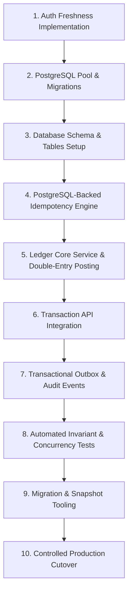

# AFRA-PAY-FINAL-IMPLEMENTATION-READINESS.md

## 1. Executive Decision

**STATUS:** `NOT READY FOR IMPLEMENTATION — ARCHITECTURE CORRECTIONS REQUIRED`

### Blockers:
1. **Direct Mutable Balance Writes Present:** The codebase actively contains direct balance overwrites on Appwrite documents in multiple active services ([backend/src/services/walletService.js](backend/src/services/walletService.js), [backend/src/services/walletTransferService.js](backend/src/services/walletTransferService.js), and [backend/src/controllers/secureTransactionController.js](backend/src/controllers/secureTransactionController.js)).
2. **Missing PostgreSQL Infrastructure:** There is no existing PostgreSQL connection pool, migration runner, or SQL schema file in the repository; the application is built entirely around Appwrite and memory stores.
3. **Broken Redis/Idempotency Integration:** The idempotency middleware [backend/src/middleware/security/idempotency.js](backend/src/middleware/security/idempotency.js) attempts to import `createClient` from a database connection manager that does not export it, defaulting silently to an un-persisted in-memory `Map()`.
4. **Stale JWT Authorization:** The authentication middleware [backend/src/middleware/auth/authenticate.js](backend/src/middleware/auth/authenticate.js) explicitly contains a `// TODO` commenting out user database reloads, accepting token claims at face value.

---

## 2. Repository Verification

*   **Current Architecture:** Monolithic Express backend (`backend/src`) connected to Appwrite (`node-appwrite`) for persistence and auth, paired with a React Native mobile client (`MobileApp`), a React user website (`Website`), and an admin dashboard (`AdminDashboard`).
*   **Relevant Modules:** Express routes (`backend/src/routes/v1`), security middleware (`backend/src/middleware/security`), transaction controllers (`backend/src/controllers/secureTransactionController.js`), and payment/wallet services (`backend/src/services/walletService.js`, `backend/src/services/walletTransferService.js`).
*   **Financial Paths:** Currently implemented via un-transactional sequential document updates in Appwrite collections (`wallets`, `transactions`, `merchant_wallets`), which update floating-point balances.
*   **Authentication:** JWT verification via jsonwebtoken. Stateless claims are trusted without verifying live user status, KYC, or role changes against the database.
*   **Database:** Appwrite Databases (`node-appwrite`). No relational or SQL database driver (e.g., `pg`) is currently integrated into package.json.
*   **Redis Usage:** `ioredis` is installed and initialized in [backend/src/database/connection.js](backend/src/database/connection.js), but it is not correctly exposed or used for distributed idempotency.
*   **Existing Transaction System:** Overlapping implementations exist in `secureTransactionController.js` and `walletTransferService.js`, both performing unsafe step-by-step balance updates.
*   **Existing Admin/Security System:** Admin actions are authenticated through JWTs with tokens stored in browser `localStorage` and readable cookies.

---

## 3. Architecture Decisions

| Decision | Final Choice | Reason | Status |
| :--- | :--- | :--- | :--- |
| **Financial Source of Truth** | PostgreSQL Ledger | Appwrite lacks multi-document ACID transactions and row-level locking. | Approved / Mandatory |
| **Database Engine** | PostgreSQL (via `pg` pool) | Provides ACID transactions, `SELECT ... FOR UPDATE`, and BigInt precision. | Approved / Mandatory |
| **Accounting Model** | Double-Entry Bookkeeping | Enforces mathematical invariance ($\sum \text{Debits} = \sum \text{Credits}$). | Approved / Mandatory |
| **Balance Model** | Immutable Ledger Entries + Derived Cache | Ledger entries are authoritative; derived balance tables allow fast reads. | Approved / Mandatory |
| **Idempotency** | PostgreSQL Unique Constraints + Redis Cache | Guarantees exact-once semantics even if Redis restarts or crashes. | Approved / Mandatory |
| **Concurrency Control** | PostgreSQL Serializable / Row Locking | Eliminates race conditions and prevents negative available balances. | Approved / Mandatory |
| **Auth Freshness** | Real-time DB / Redis User Lookup | Prevents suspended or modified users from executing financial actions. | Approved / Mandatory |
| **PIN / MFA Verification** | Server-side KCD/Hash Verification | Secures high-value transfers against unauthorized terminal access. | Approved / Mandatory |
| **Appwrite Role** | Application Data & Read Projections | Retains Appwrite for user profiles, UI projections, and static content. | Approved / Mandatory |
| **Redis Role** | Auxiliary Caching & Idempotency Fast-Path | Speeds up duplicate checks without holding financial truth. | Approved / Mandatory |
| **Audit Architecture** | Transactional Outbox + Hashed Logs | Ensures financial audit events commit atomically with ledger updates. | Approved / Mandatory |
| **Migration Strategy** | Snapshot → Opening Balances → Cutover | Safe, auditable transition from legacy mutable balances to immutable ledger. | Approved / Mandatory |
| **Rollback Policy** | Operational Recovery Only | Once cutover occurs, financial truth is immutable; never roll back to Appwrite. | Approved / Mandatory |

---

## 4. Remaining Architecture Corrections

| Severity | Issue | Evidence | Remediation Required |
| :--- | :--- | :--- | :--- |
| **BLOCKER** | Direct mutable balance updates | `walletService.js`, `walletTransferService.js` | Strip all direct balance writes; route through `LedgerService`. |
| **BLOCKER** | Missing PostgreSQL driver & schema | `backend/package.json` | Add `pg` dependency and establish PostgreSQL connection/migration infrastructure. |
| **BLOCKER** | Broken Redis idempotency wrapper | `idempotency.js:65`, `connection.js` | Fix module exports and wire PostgreSQL-backed durable idempotency. |
| **BLOCKER** | Stale JWT authentication | `authenticate.js:152` | Uncomment and enforce database user status and KYC reloading. |
| **HIGH** | Insecure token storage | `AdminDashboard/src/services/adminAPI.js` | Migrate admin JWT storage from `localStorage` to `httpOnly`, `Secure` cookies. |
| **HIGH** | Duplicate transfer execution paths | `secureTransactionController.js` vs `walletTransferService.js` | Consolidate all transfers into a single canonical posting service. |

---

## 5. Final Database Specification (PostgreSQL)

### Table: `ledger_accounts`
*   `account_id`: `VARCHAR(36) PRIMARY KEY` (UUID v4)
*   `account_type`: `VARCHAR(20) NOT NULL CHECK (account_type IN ('asset', 'liability', 'income', 'expense', 'equity'))`
*   `owner_type`: `VARCHAR(20) NOT NULL CHECK (owner_type IN ('user', 'merchant', 'system'))`
*   `owner_id`: `VARCHAR(36) NOT NULL`
*   `currency`: `VARCHAR(3) NOT NULL` (`SSP`)
*   `normal_balance`: `VARCHAR(6) NOT NULL CHECK (normal_balance IN ('debit', 'credit'))`
*   `status`: `VARCHAR(20) NOT NULL DEFAULT 'active' CHECK (status IN ('active', 'frozen', 'closed'))`
*   `created_at`: `TIMESTAMPTZ DEFAULT CURRENT_TIMESTAMP`
*   `updated_at`: `TIMESTAMPTZ DEFAULT CURRENT_TIMESTAMP`
*   *Indexes:* `UNIQUE(owner_id, currency, account_type)`, `INDEX idx_ledger_accounts_owner(owner_id)`

### Table: `ledger_transactions`
*   `ledger_transaction_id`: `VARCHAR(36) PRIMARY KEY` (UUID v4)
*   `idempotency_key`: `VARCHAR(64) UNIQUE NOT NULL`
*   `reference`: `VARCHAR(64) UNIQUE NOT NULL`
*   `currency`: `VARCHAR(3) NOT NULL`
*   `amount_minor`: `BIGINT NOT NULL CHECK (amount_minor > 0)`
*   `status`: `VARCHAR(20) NOT NULL CHECK (status IN ('pending', 'posted', 'failed', 'reversed'))`
*   `description`: `TEXT`
*   `initiated_by`: `VARCHAR(36) NOT NULL`
*   `created_at`: `TIMESTAMPTZ DEFAULT CURRENT_TIMESTAMP`
*   `posted_at`: `TIMESTAMPTZ`
*   *Indexes:* `UNIQUE(idempotency_key)`, `UNIQUE(reference)`, `INDEX idx_ledger_tx_status(status)`

### Table: `ledger_entries`
*   `entry_id`: `VARCHAR(36) PRIMARY KEY` (UUID v4)
*   `ledger_transaction_id`: `VARCHAR(36) NOT NULL REFERENCES ledger_transactions(ledger_transaction_id)`
*   `account_id`: `VARCHAR(36) NOT NULL REFERENCES ledger_accounts(account_id)`
*   `direction`: `VARCHAR(6) NOT NULL CHECK (direction IN ('debit', 'credit'))`
*   `amount_minor`: `BIGINT NOT NULL CHECK (amount_minor > 0)`
*   `created_at`: `TIMESTAMPTZ DEFAULT CURRENT_TIMESTAMP`
*   *Indexes:* `INDEX idx_ledger_entries_account(account_id)`, `INDEX idx_ledger_entries_tx(ledger_transaction_id)`

### Table: `idempotency_records`
*   `idempotency_key`: `VARCHAR(64) PRIMARY KEY`
*   `actor_id`: `VARCHAR(36) NOT NULL`
*   `request_hash`: `VARCHAR(64) NOT NULL`
*   `status`: `VARCHAR(20) NOT NULL CHECK (status IN ('processing', 'completed', 'failed'))`
*   `response_payload`: `JSONB`
*   `created_at`: `TIMESTAMPTZ DEFAULT CURRENT_TIMESTAMP`
*   `expires_at`: `TIMESTAMPTZ NOT NULL`
*   *Indexes:* `INDEX idx_idempotency_expiry(expires_at)`

### Table: `account_balances` (Derived Read Projection)
*   `account_id`: `VARCHAR(36) PRIMARY KEY REFERENCES ledger_accounts(account_id)`
*   `balance_minor`: `BIGINT NOT NULL DEFAULT 0`
*   `version`: `BIGINT NOT NULL DEFAULT 1`
*   `updated_at`: `TIMESTAMPTZ DEFAULT CURRENT_TIMESTAMP`
*   *Indexes:* `INDEX idx_account_balances_version(version)`

### Table: `outbox_events`
*   `event_id`: `VARCHAR(36) PRIMARY KEY` (UUID v4)
*   `aggregate_type`: `VARCHAR(50) NOT NULL`
*   `aggregate_id`: `VARCHAR(36) NOT NULL`
*   `event_type`: `VARCHAR(50) NOT NULL`
*   `payload`: `JSONB NOT NULL`
*   `status`: `VARCHAR(20) NOT NULL DEFAULT 'pending' CHECK (status IN ('pending', 'published', 'failed'))`
*   `created_at`: `TIMESTAMPTZ DEFAULT CURRENT_TIMESTAMP`
*   *Indexes:* `INDEX idx_outbox_status(status, created_at)`

---

## 6. Final Accounting Specification

### Chart of Accounts (Phase 1)
1.  **Customer Wallets:** Liability (`acc_usr_*`), Normal Balance: Credit. Stores user stored value.
2.  **Merchant Wallets:** Liability (`acc_mer_*`), Normal Balance: Credit. Stores merchant proceeds.
3.  **System Clearing:** Asset (`acc_sys_clearing`), Normal Balance: Debit. Incoming gateway funds holding.
4.  **Fee Revenue:** Income (`acc_sys_fees`), Normal Balance: Credit. Platform service charges.
5.  **Suspense / Reconciliation:** Asset/Liability (`acc_sys_suspense`), Normal Balance: Debit. Unmatched transactions.
6.  **Opening Balance / Migration:** Equity (`acc_sys_opening`), Normal Balance: Credit. Historical balance injection node.

### Internal Transfer Journal (User A → User B: 10,000 minor units SSP)
*   **Ledger Transaction:** `amount_minor = 10000`, `currency = 'SSP'`
*   **Entry 1:** Debit `acc_usr_sender` for `10000` (Decreases sender liability).
*   **Entry 2:** Credit `acc_usr_recipient` for `10000` (Increases recipient liability).
*   *Invariant:* $\text{Debit (10000)} = \text{Credit (10000)}$. Balanced.

### Reversal Journal
*   **Ledger Transaction:** References original transaction ID, type = `reversal`.
*   **Entry 1:** Debit `acc_usr_recipient` for original amount.
*   **Entry 2:** Credit `acc_usr_sender` for original amount.

---

## 7. Final Transaction Semantics

*   **Transaction Boundary:** All operations execute within a single PostgreSQL transaction block (`BEGIN ... COMMIT / ROLLBACK`).
*   **Locking & Concurrency:** Affected accounts are locked in deterministic order (`ORDER BY account_id ASC`) using `SELECT ... FOR UPDATE` to prevent deadlocks and race conditions.
*   **Idempotency Enforcement:** Checked via `idempotency_records` table with unique constraint. If a request arrives with an existing key and matching hash, the cached response is returned. If the hash differs, `HTTP 409 Conflict` is returned.
*   **Crash Recovery:** In-flight transactions lacking a commit record are automatically rolled back by PostgreSQL upon connection termination.

---

## 8. Final API Specification

### POST `/api/v1/transactions/send`
*   **Security:** Auth Freshness verified (DB user lookup) + Verified PIN/MFA challenge.
*   **Header:** `Idempotency-Key: <UUIDv4>`
*   **Request Body:**
```json
{
  "recipientPhone": "+211920000000",
  "amountMinor": 10000,
  "currency": "SSP",
  "description": "Payment for services",
  "pin": "123456"
}
```
*   **Response (HTTP 201 Created):**
```json
{
  "success": true,
  "data": {
    "transactionId": "tx_abc123",
    "reference": "TXN-SSP-20260909-001",
    "status": "completed",
    "amountMinor": 10000,
    "currency": "SSP",
    "balanceAvailableMinor": 40000,
    "createdAt": "2026-09-09T15:00:00.000Z"
  },
  "error": null
}
```

---

## 9. Final Security Specification

*   **Auth Freshness:** Every protected request executes a database query to confirm `status === 'active'`, valid KYC level, and matching token/session version.
*   **PIN Security:** Stored using secure hashing (e.g., Argon2id or PBKDF2 with high iteration count). Never logged or returned in API payloads. Rate-limited to 5 failed attempts per 15 minutes.
*   **Admin Security:** Admin session tokens migrated to `httpOnly`, `Secure`, `SameSite=Strict` cookies. `localStorage` token storage eliminated for admins.
*   **PII & Logging:** Strict sanitization rules redact sensitive financial credentials, full card numbers, and PIN codes from Winston logs.

---

## 10. Migration & Cutover Specification

1.  **Freeze:** Set maintenance mode flag; block all mutating endpoints.
2.  **Snapshot:** Export all Appwrite wallet documents and balances.
3.  **Validate:** Run automated checksum validation comparing user wallet sums against system totals.
4.  **Seed Accounts:** Create corresponding `ledger_accounts` in PostgreSQL for every valid user wallet.
5.  **Opening Balances:** Post historical balances as opening journal entries against `acc_sys_opening`.
6.  **Shadow Verification:** Run dual-read comparison validating derived balances against Appwrite projections.
7.  **Cutover:** Enable Ledger Core write path; disable all legacy direct balance mutation code paths.

---

## 11. Recovery & Rollback Specification

*   **Pre-Cutover Rollback:** If migration validation fails, disable maintenance mode and revert to the unmodified legacy Appwrite structure.
*   **Post-Cutover Recovery:** Once PostgreSQL is live, **never** roll back financial truth to Appwrite. Failures are handled via operational database recovery, point-in-time restoration, and compensating adjustment entries.

---

## 12. Legacy Financial Path Elimination

| Current Path | File | Risk | Replacement | Final Action |
| :--- | :--- | :--- | :--- | :--- |
| `POST /api/v1/transactions/transfer` | `secureTransactionController.js` | Direct Appwrite balance overwrite | `LedgerService.executeTransfer()` | **REMOVE & REPLACE** |
| `debitMerchantWallet` | `walletService.js` | Race condition on direct balance write | Ledger-backed merchant debit | **REMOVE & REPLACE** |
| `creditMerchantWallet` | `walletService.js` | Un-transactional balance write | Ledger-backed merchant credit | **REMOVE & REPLACE** |
| `_getOrCreateWallet` | `walletTransferService.js` | Implicit financial entity creation | Explicit account provisioning | **REFACTOR** |

---

## 13. Implementation Dependency Graph



---

## 14. Implementation Task Breakdown

### Task ID: TSK-01
*   **Task Name:** Auth Freshness & User State Revalidation
*   **Objective:** Ensure every authenticated request validates user status and KYC directly from the database.
*   **Files/Modules Affected:** [backend/src/middleware/auth/authenticate.js](backend/src/middleware/auth/authenticate.js)
*   **Dependencies:** None
*   **Implementation Requirements:** Uncomment database user lookup; verify active status and role.
*   **Security Requirements:** Block suspended or deactivated users immediately.
*   **Database Requirements:** Appwrite user read or Redis user session cache lookup.
*   **Testing Requirements:** Unit tests for suspended user rejection.
*   **Acceptance Criteria:** A token issued to a user who is subsequently deactivated is rejected with 401 Unauthorized.
*   **Rollback Considerations:** Revert middleware changes if database latency exceeds threshold.
*   **Risk Level:** Medium

### Task ID: TSK-02
*   **Task Name:** PostgreSQL Database Client & Migration Framework Setup
*   **Objective:** Establish a robust PostgreSQL connection pool and migration runner.
*   **Files/Modules Affected:** `backend/src/database/pgConnection.js`, `backend/migrations/`
*   **Dependencies:** TSK-01
*   **Implementation Requirements:** Configure `pg` pool with environment variables, SSL support, and health checks.
*   **Security Requirements:** Encrypted connection strings; secure credential handling.
*   **Database Requirements:** PostgreSQL 15+ instance.
*   **Testing Requirements:** Connection health check test.
*   **Acceptance Criteria:** Server successfully connects and verifies DB ping on startup.
*   **Rollback Considerations:** Graceful fallback / startup failure on DB unreachable.
*   **Risk Level:** Low

### Task ID: TSK-03
*   **Task Name:** Relational Ledger Schema & Constraints Deployment
*   **Objective:** Deploy the core financial tables (`ledger_accounts`, `ledger_transactions`, `ledger_entries`, `idempotency_records`, `account_balances`, `outbox_events`).
*   **Files/Modules Affected:** `backend/migrations/001_core_ledger.sql`
*   **Dependencies:** TSK-02
*   **Implementation Requirements:** Create tables with strict foreign keys, check constraints, and indexes.
*   **Security Requirements:** Least-privilege database user role for application queries.
*   **Database Requirements:** PostgreSQL execution of DDL statements.
*   **Testing Requirements:** Schema validation tests.
*   **Acceptance Criteria:** All tables, constraints, and indexes created successfully without errors.
*   **Rollback Considerations:** Down-migration script dropping tables (pre-cutover only).
*   **Risk Level:** High

### Task ID: TSK-04
*   **Task Name:** Durable PostgreSQL Idempotency Engine
*   **Objective:** Replace memory-based idempotency with a PostgreSQL-backed durable engine.
*   **Files/Modules Affected:** `backend/src/middleware/security/durableIdempotency.js`
*   **Dependencies:** TSK-03
*   **Implementation Requirements:** Implement atomic `INSERT INTO idempotency_records` with request fingerprinting.
*   **Security Requirements:** Prevent cache poisoning and key collisions.
*   **Database Requirements:** `idempotency_records` table.
*   **Testing Requirements:** Concurrent duplicate request tests.
*   **Acceptance Criteria:** Duplicate requests return cached responses or 409 Conflict.
*   **Rollback Considerations:** Revert to middleware fallback if database error occurs.
*   **Risk Level:** High

### Task ID: TSK-05
*   **Task Name:** Ledger Core Service & Double-Entry Posting Engine
*   **Objective:** Implement the foundational ledger posting logic adhering to $\sum \text{Debits} = \sum \text{Credits}$.
*   **Files/Modules Affected:** `backend/src/services/ledgerService.js`
*   **Dependencies:** TSK-04
*   **Implementation Requirements:** Atomic SQL transaction execution with deterministic account locking (`SELECT ... FOR UPDATE`).
*   **Security Requirements:** Prevent unbalanced entries or negative amounts.
*   **Database Requirements:** PostgreSQL transactions.
*   **Testing Requirements:** Unit tests for balanced/unbalanced journal validation.
*   **Acceptance Criteria:** Unbalanced journals are rejected with an error; balanced journals commit atomically.
*   **Rollback Considerations:** Transaction rollback on any validation failure.
*   **Risk Level:** Critical

### Task ID: TSK-06
*   **Task Name:** Transaction API Integration & Legacy Path Replacement
*   **Objective:** Route `POST /api/v1/transactions/send` through `LedgerService` and deprecate direct balance updates.
*   **Files/Modules Affected:** `backend/src/controllers/secureTransactionController.js`, `backend/routes/v1/transactions.js`
*   **Dependencies:** TSK-05
*   **Implementation Requirements:** Replace legacy transfer logic with ledger service calls.
*   **Security Requirements:** Require auth freshness, PIN verification, and idempotency headers.
*   **Database Requirements:** PostgreSQL ledger tables.
*   **Testing Requirements:** End-to-end integration tests for P2P transfers.
*   **Acceptance Criteria:** Successful transfer correctly debits sender and credits receiver in the ledger.
*   **Rollback Considerations:** Feature flag toggle back to maintenance mode if errors arise.
*   **Risk Level:** Critical

### Task ID: TSK-07
*   **Task Name:** Transactional Outbox & Audit Logging
*   **Objective:** Ensure durable audit events commit atomically with financial postings.
*   **Files/Modules Affected:** `backend/src/services/auditOutboxService.js`
*   **Dependencies:** TSK-06
*   **Implementation Requirements:** Write outbox events within the same SQL transaction as ledger entries.
*   **Security Requirements:** Redact PII and secrets from audit payloads.
*   **Database Requirements:** `outbox_events` table.
*   **Testing Requirements:** Audit log verification tests.
*   **Acceptance Criteria:** Every committed ledger transaction generates a corresponding durable audit/outbox event.
*   **Rollback Considerations:** Non-blocking async worker failure handling.
*   **Risk Level:** Medium

### Task ID: TSK-08
*   **Task Name:** Automated Concurrency & Invariant Test Suite
*   **Objective:** Build rigorous automated test suites for concurrency, double-spend prevention, and accounting invariants.
*   **Files/Modules Affected:** `backend/tests/ledger/`
*   **Dependencies:** TSK-07
*   **Implementation Requirements:** Jest/Mocha integration tests simulating 50+ simultaneous transfers.
*   **Security Requirements:** Simulate race conditions and replay attacks.
*   **Database Requirements:** Test PostgreSQL database instance.
*   **Testing Requirements:** Concurrency load tests.
*   **Acceptance Criteria:** Zero double-spend successes under heavy concurrent load.
*   **Rollback Considerations:** None (Testing task).
*   **Risk Level:** High

### Task ID: TSK-09
*   **Task Name:** Migration & Opening Balance Tooling
*   **Objective:** Build scripts to snapshot Appwrite wallets, validate totals, and inject opening balances into PostgreSQL.
*   **Files/Modules Affected:** `backend/scripts/migrateToLedger.js`
*   **Dependencies:** TSK-08
*   **Implementation Requirements:** Export Appwrite balances, verify checksums, and post opening journals.
*   **Security Requirements:** Restricted execution permissions (admin/operator only).
*   **Database Requirements:** Appwrite source + PostgreSQL target.
*   **Testing Requirements:** Dry-run migration validation tests.
*   **Acceptance Criteria:** Sum of Appwrite snapshot balances exactly matches sum of PostgreSQL opening ledger balances.
*   **Rollback Considerations:** Abort migration before cutover if checksum mismatch occurs.
*   **Risk Level:** Critical

### Task ID: TSK-10
*   **Task Name:** Controlled Production Cutover
*   **Objective:** Execute final migration cutover, disable legacy writes, and enable live ledger routing.
*   **Files/Modules Affected:** Production deployment configuration.
*   **Dependencies:** TSK-09
*   **Implementation Requirements:** Maintenance mode activation, final validation, cutover execution, and post-cutover verification.
*   **Security Requirements:** Operational sign-off.
*   **Database Requirements:** Live PostgreSQL ledger database.
*   **Testing Requirements:** Smoke tests post-cutover.
*   **Acceptance Criteria:** Platform successfully operating exclusively on PostgreSQL double-entry ledger.
*   **Rollback Considerations:** Post-cutover operational recovery protocol (never roll back truth to Appwrite).
*   **Risk Level:** Critical

---

## 15. Phased Implementation Plan

### Phase A — Security & Infrastructure Remediation
*   TSK-01: Auth Freshness & User State Revalidation
*   TSK-02: PostgreSQL Database Client & Migration Framework Setup

### Phase B — PostgreSQL Ledger Foundation
*   TSK-03: Relational Ledger Schema & Constraints Deployment
*   TSK-04: Durable PostgreSQL Idempotency Engine

### Phase C — Ledger Core
*   TSK-05: Ledger Core Service & Double-Entry Posting Engine

### Phase D — Financial API Integration
*   TSK-06: Transaction API Integration & Legacy Path Replacement

### Phase E — Audit, Outbox & Reconciliation
*   TSK-07: Transactional Outbox & Audit Logging

### Phase F — Migration & Shadow Validation
*   TSK-08: Automated Concurrency & Invariant Test Suite
*   TSK-09: Migration & Opening Balance Tooling

### Phase G — Controlled Production Cutover
*   TSK-10: Controlled Production Cutover

---

## 16. Implementation Order

1.  **TSK-01 (Auth Freshness):** Must happen first to ensure that no sensitive operations accept unverified token claims before we touch financial logic.
2.  **TSK-02 & TSK-03 (PostgreSQL Setup & Schema):** Required before any ledger code can be written or compiled.
3.  **TSK-04 (Durable Idempotency):** Required to protect the ledger service from replay attacks and concurrent double-spending.
4.  **TSK-05 (Ledger Core Service):** The foundational double-entry posting engine upon which all financial transactions rely.
5.  **TSK-06 (API Integration):** Connects the API layer to the Ledger Core while removing legacy balance mutation paths.
6.  **TSK-07 (Audit & Outbox):** Ensures regulatory and operational audit trails are captured transactionally.
7.  **TSK-08 (Testing):** Validates concurrency and invariants before touching production data.
8.  **TSK-09 (Migration Tooling):** Prepares data extraction and opening balance injection.
9.  **TSK-10 (Cutover):** Final production launch.

---

## 17. Testing & Acceptance Matrix

| Requirement | Test Description | Expected Result | Blocking? |
| :--- | :--- | :--- | :--- |
| **Double-Entry Invariant** | Post transfers with unbalanced debits/credits | Rejected by database constraint / Ledger service validation | **Yes** |
| **Concurrency Safety** | 50 simultaneous debit requests on single wallet | Exactly 1 succeeds, 49 fail with serialization/OCC error | **Yes** |
| **Idempotency** | Send same request with same idempotency key 10 times | Returns identical cached response; only 1 ledger entry created | **Yes** |
| **Auth Freshness** | Request transfer using token of deactivated user | Rejected with HTTP 401 Unauthorized | **Yes** |
| **Opening Balance Check** | Sum appwrite snapshot vs PostgreSQL ledger opening total | Exact byte-for-byte minor unit match | **Yes** |

---

## 18. Production Readiness Checklist

*   [ ] PostgreSQL ledger database deployed with SSL and connection pooling.
*   [ ] All direct Appwrite balance update paths removed from code.
*   [ ] Double-entry posting engine verified with automated tests.
*   [ ] PostgreSQL-backed durable idempotency tested against server restarts and timeouts.
*   [ ] Auth freshness middleware re-verifying user status on every sensitive request.
*   [ ] Admin token storage migrated to `httpOnly` secure cookies.
*   [ ] Transactional outbox pattern verified for durable audit logging.
*   [ ] Automated concurrency test suite passing zero double-spends under 50+ load.
*   [ ] Migration script dry-run successfully verified against staging snapshot.
*   [ ] Disaster recovery point-in-time recovery and restoration drills successfully tested.

---

## 19. Final Implementation Authorization

### ARCHITECTURE STATUS
`BLOCKED — ARCHITECTURE CORRECTIONS REQUIRED`

### First Authorized Implementation Task
Upon explicit review and approval of this readiness document, the first authorized task to begin implementation will be:
> **TSK-01: Auth Freshness & User State Revalidation**
